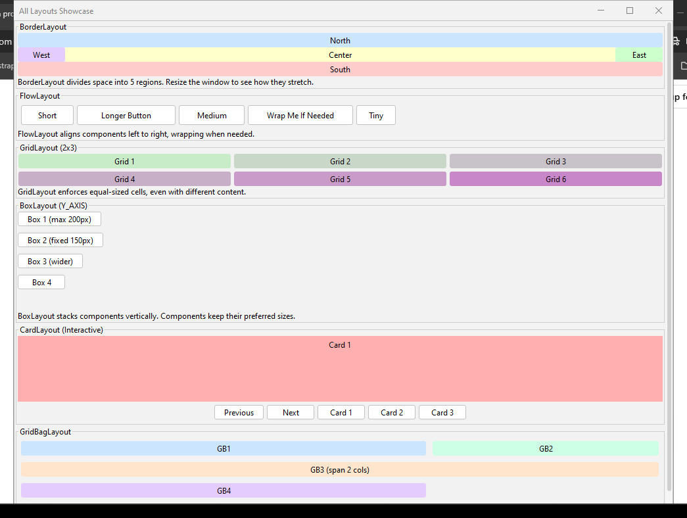

# 💡 Java Swing Layouts Showcase

An interactive demo application showcasing all major Java Swing layout managers:

📦 `BorderLayout`, `FlowLayout`, `GridLayout`, `BoxLayout`, `CardLayout`, and `GridBagLayout`.

Built with **Java 11** and **FlatLaf** for a modern UI.

Ideal for **students**, **educators**, and **developers** learning Java GUI development.



---

## 📁 Project Structure

```plaintext
JavaSwingLayouts/
├── exe/                     # Windows executable (.exe) generated via Launch4j
│   └── JavaSwingLayouts.exe
├── lib/                     # External libraries (FlatLaf)
│   └── flatlaf-3.6.jar
├── nbproject/               # NetBeans project metadata
├── src/
│   └── LayoutsShowcase/     # Java source package
│       └── LayoutShowcase.java
├── dist/                    # Generated JAR file (JavaSwingLayouts.jar)
├── build.xml                # Ant build script
├── manifest.mf              # Manifest file
├── LICENSE                  # MIT License
├── README.md                # This file
└── ApplicationDemo.png      # Screenshot of the application
```
---

## 🚀 How to Run

### ✅ Option 1 – Run Executable (Windows Only)
Navigate to the `exe/` folder and double-click:

### ✅ Option 2 – Run via NetBeans
1. Open the project in **NetBeans**.
2. Make sure JDK 11 is configured.
3. Run the `LayoutShowcase.java` file.

> ☕ **Requires:** Java Development Kit (JDK) 11+

---

## ✨ Features

- View real-time behavior of all major Swing layouts.
- Modern FlatLaf look and feel for clean UI.
- Interactive resizing & layout changes.
- **CardLayout** demo includes buttons to switch views dynamically.
- Lightweight and easy to modify for your learning needs.

---

## 🛠️ Built With

- **Java 11**
- **Swing GUI Toolkit**
- **FlatLaf v3.6** – modern, open-source Look & Feel
- **Launch4j** – for `.exe` packaging
- **NetBeans** – as IDE (optional)

---

## 🙋 Contribution

Found an issue or want to contribute?  
Feel free to [open an issue](https://github.com/Mavros-Lykos/java-swing-layouts-showcase/issues) or submit a pull request!

---

## 📜 License

This project is licensed under the **MIT License**.  
See the [LICENSE](./LICENSE) file for details.


<!--

> ⚠️ *If you'd like to restrict commercial use and allow educational-only usage, consider switching to Creative Commons BY-NC 4.0. Let me know if you'd like help updating this.*
-->
---

<!--
## 👤 Author

(https://github.com/Mavros-Lykos)

-->
